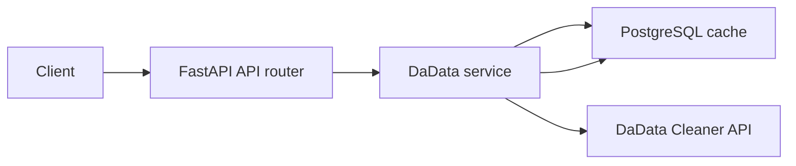

# System Patterns

## Architecture Overview
- [`app/main.py`](../app/main.py:35) initializes the FastAPI lifespan and starts cache, DaData, and geolocation services before serving requests.
- [`app/routers/api.py`](../app/routers/api.py:24) owns API endpoints for DaData-backed address cleaning plus health and metrics.
- [`app/services/dadata.py`](../app/services/dadata.py:21) is the DaData client and cache-aware domain service.
- [`app/services/cache.py`](../app/services/cache.py:17) provides the PostgreSQL-only cache backend.
- [`app/routers/static_files.py`](../app/routers/static_files.py:94) is the catch-all static file router and must remain after API routers.

## ADR: PostgreSQL-only cache for DaData and geolocation
Date: 2026-06-22
Status: accepted
Context: Runtime cache behavior previously included file/Redis-era concepts. Deployment validation required durable cache behavior and import of legacy file cache data.
Decision: Use PostgreSQL schema `fideliopro_website` with table `cache_entries` keyed by `namespace` and `cache_key`, storing values as JSONB.
Consequences: Positive: durable cache survives restarts, supports namespace counts, and imports legacy cache data. Negative: application startup requires valid `DATABASE_URL` when cache is enabled.
Alternatives: File cache kept simple but fragile for containers; Redis would add another runtime dependency; no cache would increase DaData cost and latency.
Links: [`memory-bank/progress.md`](progress.md:15), [`app/services/cache.py`](../app/services/cache.py:48)

## ADR: Compatibility API endpoints return plain text
Date: 2026-07-16
Status: accepted
Context: Existing clients use legacy endpoints for address cleaning and expect raw text values rather than structured JSON.
Decision: Keep `/apiaddress/api` and `/apifulladdress/api` as query-parameter based GET endpoints returning `PlainTextResponse`.
Consequences: Positive: minimal client migration risk. Negative: error semantics are less expressive, especially when DaData credentials are missing but the endpoint returns an address-related HTTP 400.
Alternatives: JSON response models would be clearer for new clients but could break compatibility; adding parallel JSON endpoints remains possible.
Links: [`app/routers/api.py`](../app/routers/api.py:24), [`app/routers/api.py`](../app/routers/api.py:85)

## ADR: DaData Suggestions endpoint caches full successful passthrough responses
Date: 2026-07-16
Status: proposed
Context: A new endpoint is needed for DaData address suggestions. It must not change the DaData response and must avoid repeated paid upstream calls for identical requests.
Decision: Add `POST /api/suggest/address` as a JSON passthrough endpoint. Cache successful HTTP 200 DaData Suggestions responses in PostgreSQL under a dedicated namespace using a deterministic key derived from the entire incoming JSON request body.
Consequences: Positive: identical interactive suggestion requests avoid repeated paid calls and clients receive the upstream response shape unchanged. Negative: suggestions may become stale because the current cache has no TTL; cache keys must include all request parameters to avoid incorrect reuse.
Alternatives: Query-only GET endpoint would be simpler but would not support the full DaData request contract; transforming response would simplify consumers but violates passthrough requirement; shared raw-result cache could reduce duplicate calls across endpoints but is a larger redesign.
Links: [`README_dadata.md`](../README_dadata.md:155), [`app/services/dadata.py`](../app/services/dadata.py:21), [`app/services/cache.py`](../app/services/cache.py:48)

## Component and Boundary Contracts
- API router boundary: validate request parameters and translate service failures into HTTP responses.
- DaData service boundary: handle upstream credentials, HTTP session lifecycle, upstream status handling, and cache-aware field extraction.
- Cache service boundary: provide namespace-scoped `get`, `set`, `delete`, `health_check`, and namespace count operations without exposing SQL details to routers.
- Static file router boundary: serve website assets after API routes have had first chance to match.

## Cross-Cutting Concerns
- Observability: request logging middleware enriches logs and skips avoidable geolocation overhead for health, metrics, and loopback probes.
- Resilience: metrics cache calls are bounded with timeouts; health JSON still performs direct service checks.
- Cost control: DaData health check result is memoized for five minutes because upstream health checks call the paid cleaner API.
